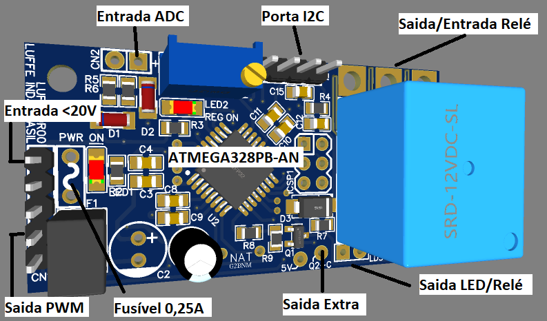

### Programando Sistemas Embarcados com a Placa de Prototipação Arduino
Por: Roberto Oliveira

Entendendo o Desafio:
 
Agora é a sua hora de brilhar e construir um perfil de destaque na DIO! Explore todos os conceitos explorados até aqui e replique (ou melhore, porque não?) este projeto prático. Para isso, crie seu próprio repositório e aumente ainda mais seu portfólio de projetos no GitHub, o qual pode fazer toda diferença em suas entrevistas técnicas 😎
 
Neste repositório, insira todos os links e arquivos necessários para seu projeto, seja um arquivo de banco de dados ou um link para o template no Figma.
 
Dica: Se o expert forneceu um repositório Github, você pode dar um "fork" no repositório dele para organizar suas alterações e evoluções mantendo uma referência direta ao código-fonte original.
 
Instruções
 Programando Sistemas Embarcados com a Placa de Prototipação Arduino.docx
 
Bons estudos!

Projetos desenvolvidos também com layout PCB e esquema elétrico.

Trabalhando atualmente em :
- Sistema - MUF800R00
- Versão atual - V4 Serial :
  - Automático 12v/24v/36v/48v
  - Tracionário 12v/24v/36v/48v
  - Bloqueador 12v/24v/36v/48v 

Sistemas desenvolvidos para uso industrial.
- MUF800R00: -> Sistema alvo Arduino -> WIP saida JSON
  - Sistema de automação simples, com disponibilidade de acoplamento em outros sistemas.
  - Sistema de controle por tensão
  - Sistema de medição ADC
  - Sistema de controle automatizado geral
- MUF700R00: -> Sistema alvo Arduino
  - Sistema de controle PWM para resistencias de aquecedores, porém usadas em outra finalidade em ambiente industrial e com baterias
- PSU100R00: -> Fonte de alimentação

MUF800R00 

